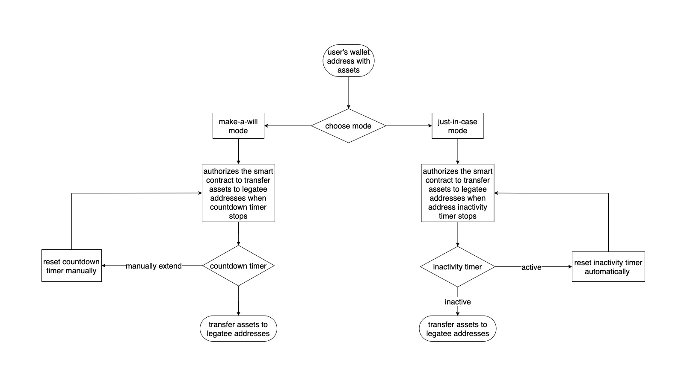

# Webgacy v0

## Project Description

### About Webgacy

Webgacy is a web3 project focusing on handling digital legacy for web3 users. Using Webgacy, web3 users with a crypto wallet will be able to make a bequest to any other wallet address without having to expose their private keys to anyone else (including the legatee). 

### Why Webgacy

Your web3 assets are only as secure as how you keep your private keys a secret (aka “*not your keys, not your crypto*”). Once the private keys get lost or exposed, your web3 assets will become inaccessible or be stolen. In the event of death (definitely a topic we don’t want to talk about too often), if no one else knows about your well-kept private keys, your assets are considered lost permanently. You might think telling your legatee your private keys is a simple way to bequeath your web3 legacy, but then your private key gets exposed anyway. 

In short, not exposing private keys is of utmost importance. With that in mind, we provide an alternative solution for web3 users to handle their web3 legacy beforehand. 

### User Workflow / Key Features

**Connect Wallet** 

1. Connect wallet to the site and authorize it to display all the ERC20 and ERC721 assets owned by the user.
2. Select an asset and choose a mode for that asset - either **make-a-will mode** or **just-in-case mode.**
    1. **Make-a-will mode** is for users who would consider themselves to be dead in the foreseeable future.
    2. **Just-in-case mode** is for general users who would like to prepare for accidental death.

**Make-a-will Mode**

1. Choose **make-a-will mode.**
2. Input the **legatee wallet address** and **countdown time**.
    - **legatee wallet address** is the specified address to be receiving the asset.
    - **countdown time** can be set as 3/6/12/18 months[^1].
3. Confirm and sign the transaction.
4. Countdown timer will start counting down. 
    - Resetting the countdown timer manually to extend or reduce the time is allowed at any time.
5. A transaction of transferring the asset to the **legatee wallet address** will be automatically initiated and executed once the **countdown time** is running out[^2].

**Just-in-case mode** 

1. Choose **just-in-case mode .**
2. Input the **legatee wallet address** and **inactivity time**.
    - **legatee wallet address** is the specified address to be receiving the asset.
    - **inactivity time**, which can be set as 3/6/12/18 months, refers to the period of a wallet address being considered inactive by monitoring its `nonce` not having incremented.
3. Confirm and sign the transaction.
4. Inactivity timer will start counting down. 
    - Every time the `nonce` increments, the inactivity timer will be reset to the **inactivity time** previously set.
    - Resetting the inactivity timer manually to extend or reduce the time is allowed at any time.
5. A transaction of transferring the asset to the **legatee wallet address** will be automatically initiated and executed once the **inactivity time** is running out.

### Notice / Caveat

- [^1]: For demonstration purpose, **countdown time** and **inactivity time** can only be set as 3/6/12/18 minutes at the moment.
- [^2]: If the to-be-bequeathed asset gets transferred before the final bequest transfer taking place,  the bequest transfer will be canceled automatically.

### Tech Stack / Toolings
- Alchemy
- Hardhat
- Ethersjs
- Moralis
- React
- Chainlink Keeper

## Project Installation

## Future Improvements

- Email notification
    - When the timer is running low (1 month remained to execute the transfer), an email will be sent to the user to get notified.